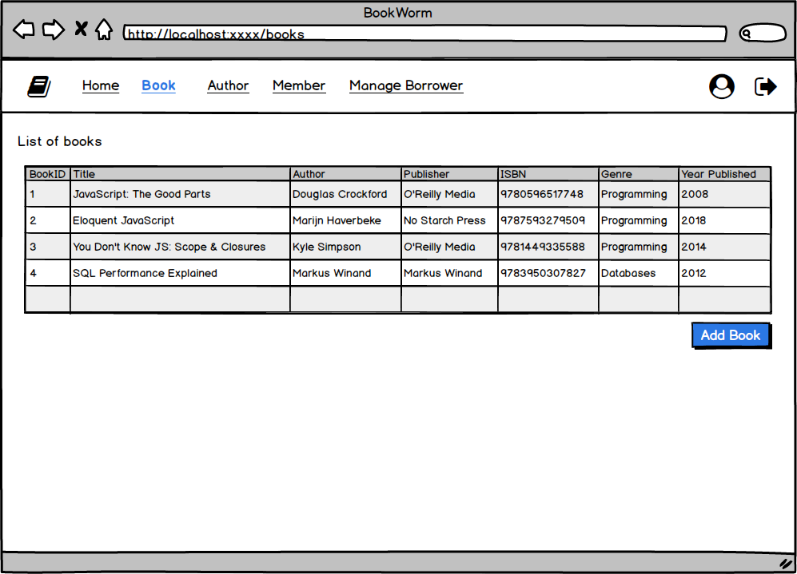
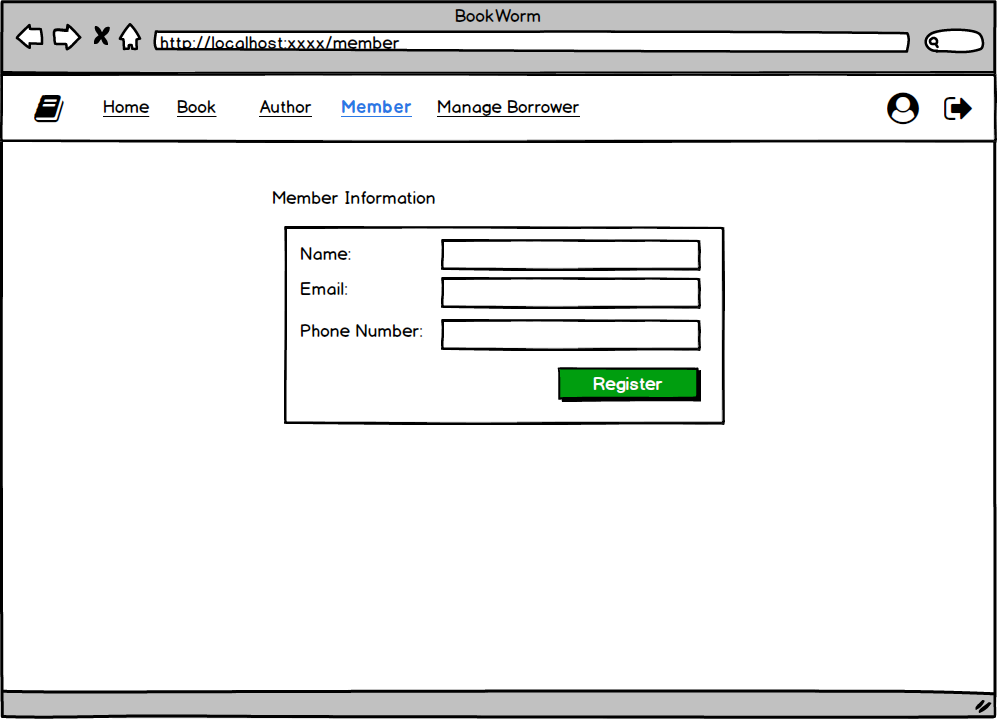

### Assignment: Library Management System I ERD

#### Estimated Time of Completion

60 minutes

#### Level of Complexity

Low

#### Evaluation Criteria

- Completeness of ERD: All required fields are present.
- Correctness: Appropriate use of MySQL data types.
- Clarity: The diagram is clear and easy to understand.

#### Learning Outcomes

- Create the tables using appropriate MySQL data types.

#### Instructions

You will design an ERD with separates tables for Books, Authors, and Members. Identify the fields and their appropriate data types.

Refer to the provided mockup images for visual guidance on the functionalities and structure of the platform.

**Submission:**

- Create your ERD using MySQL Workbench.
- Export and upload your ERD diagram to submit.
