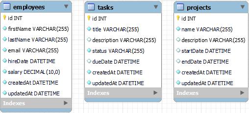

### Assignment: Management I

Learn how to define multiple Sequelize models and synchronize them with a MySQL database to create corresponding tables.

**Estimated Time to Completion:** 120 minutes

**Level of Complexity:** Medium

**Instructions**

1. Read through the directions below.
2. Complete the required elements as outlined.
3. Submit your GitHub URL with the completed code by the due date.

**Evaluation Criteria & Learning Objectives**

- **Define Sequelize models for Employee, Project, and Task:** Accurately create models with appropriate fields and data types.
- **Synchronize the models with a MySQL database:** Ensure the models create the corresponding tables in the database.
- **Validate the creation of the tables using MySQL Workbench:** Confirm that the tables and data are correctly created and visible in MySQL Workbench.

**Directions**

1. **Set up the project**
    - Create a new Node.js project.
    - Install the necessary dependencies: sequelize, mysql2, and sequelize-cli.
    - Initialize Sequelize in your project.
2. **Configure the Database**
    - Create a MySQL database named `management_db`.
    - Configure Sequelize to connect to this database using the provided configuration file.
3. **Define the Models**
    - *Employee Model:*
        - `id`: Integer, Primary Key, Auto Increment
        - `firstName`: String, not null
        - `lastName`: String, not null
        - `email`: String, unique, not null
        - `hireDate`: Date, not null
        - `salary`: Decimal, not null
    - *Project Model:*
        - `id`: Integer, Primary Key, Auto Increment
        - `name`: String, not null, unique
        - `description`: String
        - `startDate`: Date
        - `endDate`: Date
    - *Task Model:*
        - `id`: Integer, Primary Key, Auto Increment
        - `title`: String, not null
        - `description`: String
        - `status`: String, not null (e.g., 'Not Started', 'In Progress', 'Completed')
        - `dueDate`: Date
4. **Synchronize the Models**
    - Use Sequelize’s sync method to create the `Employee`, `Project`, and `Task` tables in the `management_db` database based on your models.
    - Ensure you are calling the models in your synchronization script to register them with Sequelize.
5. **Insert Sample Data (Optional but Recommended)**
    - After synchronizing the models, insert sample data into each table to test the setup.

**Expected Outputs:**

- Tables Created: `Employee`, `Project`, `Task`
- Sample Data: (if added) Inserted into each table

**Additional Notes:**

- Ensure that each table accurately reflects the defined model structure.
- Submit screenshots or exports from MySQL Workbench showing the tables and sample data.