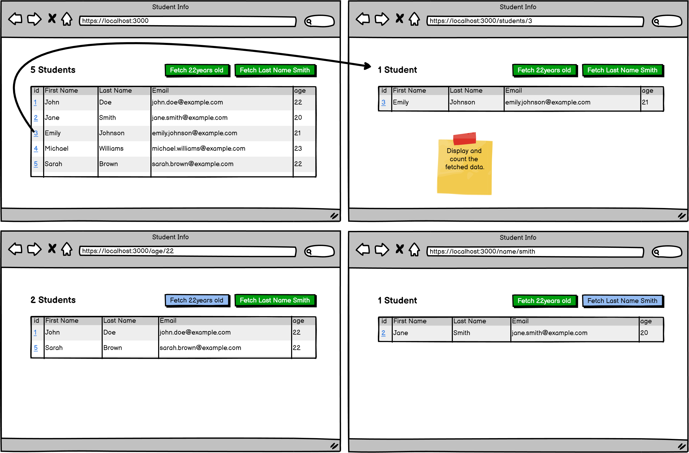

#  Assignment: Student Info I
Learn how to read data from a Sequelize-managed database using various query techniques.




**Estimated Time to Completion:** 90 minutes

**Level of Complexity:** Medium

## Instructions
1. Read through the directions below. Note: you will be provided any necessary files on which to work.
2. Complete the necessary elements as outlined.
3. Zip the project and submit to [XXXXX] by the due date.

## Evaluation Criteria & Learning Objectives
- Perform SELECT queries to read data from the database.
- Use Sequelize ORM queries to retrieve data according to specified conditions.

## Directions
For this assignment, you will work with a `students_db` schema that has been pre-populated with some dummy data. Your task is to use Sequelize to write queries that read data from the database.

### Dummy Data
Create a SQL script to populate the `students_db` schema with the following data:

```sql
-- Create Students Table
CREATE TABLE Students (
    id INT AUTO_INCREMENT PRIMARY KEY,
    first_name VARCHAR(100) NOT NULL,
    last_name VARCHAR(100) NOT NULL,
    email VARCHAR(255) UNIQUE NOT NULL,
    age INT NOT NULL,
    createdAt TIMESTAMP DEFAULT CURRENT_TIMESTAMP,
    updatedAt TIMESTAMP DEFAULT CURRENT_TIMESTAMP ON UPDATE CURRENT_TIMESTAMP
);

-- Insert Data with Dummy Timestamps
INSERT INTO Students (first_name, last_name, email, age, createdAt, updatedAt) VALUES
('John', 'Doe', 'john.doe@gmail.com', 22, '2023-01-01 10:00:00', '2023-01-01 10:00:00'),
('Jane', 'Smith', 'jane.smith@gmail.com', 20, '2023-01-02 11:00:00', '2023-01-02 11:00:00'),
('Emily', 'Johnson', 'emily.johnson@gmail.com', 21, '2023-01-03 12:00:00', '2023-01-03 12:00:00'),
('Michael', 'Williams', 'michael.williams@gmail.com', 23, '2023-01-04 13:00:00', '2023-01-04 13:00:00'),
('Sarah', 'Brown', 'sarah.brown@gmail.com', 22, '2023-01-05 14:00:00', '2023-01-05 14:00:00');
```

### Queries
Using Sequelize, complete the following queries to retrieve data from the `Students` table:

1. Retrieve All Students:
   - Fetch all students from the `Students` table.

2. Find Student by ID:
   - Fetch a student by ID when the ID link is clicked.

3. Find Students by Age:
   - Fetch all students who are 22 years old.

4. Find Student by Last Name:
   - Fetch a student with the last name Smith.

5. Count Total Students:
   - Count the total number of students in the table.

### Sample Code Snippets
Here are some sample code snippets to guide you:

```ts
/* Sample query to fetch all students */
const allStudents = await Student.findAll({
    attributes: ['id', 'first_name', 'last_name', 'email']
});

/* Sample query to find a student by ID */
const studentById = await Student.findOne({
    where: { id: :id },   /* Replace :id with actual student ID */
    attributes: ['first_name', 'last_name', 'email']
});
```

## Expected Outputs
- Students List: A list of all students with their id, first_name, last_name, and email.
- Buttons to perform the challenges.

## Additional Notes
- Ensure that you validate your queries using MySQL Workbench or a similar tool.
- Submit your query files and any screenshots or exports showing the results.
