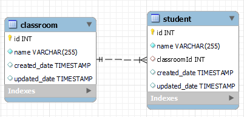

### Assignment: Query One-to-Many Relationships with ORM (Classroom)

In this assignment, you will work with Sequelize to implement and query a one-to-many relationship between two models: Classroom and Student. Your tasks will include creating, reading, and deleting records while managing these relationships effectively.

**Estimated Time to Completion:** 90 mins

**Level of Complexity:** Medium

**Instructions**

1. **Define Models:**
    - **Classroom Model:**
        - Define attributes such as id and name.
    - **Student Model:**
        - Define attributes such as id, name, and classroomId (foreign key to Classroom).
2. **Set Up Relationships:**
    - Establish a one-to-many relationship where a Classroom can have many Students, and each Student belongs to one Classroom.
    - 
        
        
        
3. **Implement Routes:**
    - **`/index`:** Display all classrooms.
        - Implement functionality so that clicking on a classroom shows all students assigned to that classroom.
    - **`/class/new`:** Route to create a new classroom.
    - **`/student/new`:** Route to create a new student and assign them to a classroom.
4. **Implement CRUD Operations:**
    - **Read:**
        - Retrieve all students for a specific classroom.
        - Retrieve all classrooms.
        - Retrieve all students.
    - **Create:**
        - Add new classrooms.
        - Add new students and assign them to existing classrooms.
    - **Delete:**
        - Remove classrooms (ensure proper handling of associated students).
        - Remove students.
5. **Validate:**
    - Ensure that all CRUD operations are working correctly and that relationships are managed properly.
6. **Submit Your Work:**
    - Provide a link to your code repository with the completed assignment.
    - Include any relevant documentation or screenshots to demonstrate your implementation.

**Directions**

1. **Define Models and Relationships:**
    - Create Classroom and Student models with the appropriate attributes and relationships.
2. **Implement Routes and CRUD Operations:**
    - Set up routes and functionality to handle the CRUD operations as described.
3. **Test the Implementation:**
    - Ensure all routes and operations work as expected and handle data relationships correctly.

**Evaluation Criteria & Learning Objectives**

- **Define and implement one-to-many relationships between Sequelize models:** Properly set up and manage relationships.
- **Create routes to handle CRUD operations for Classroom and Student:** Ensure all CRUD functionality is implemented and working.
- **Ensure relationships are respected and managed correctly:** Verify that data integrity and relationships are maintained.
- **Validate the functionality of the implemented routes and operations:** Confirm that all operations behave as expected.

**Expected Outputs**

- **Model Definitions:** Correctly defined Classroom and Student models with one-to-many relationships.
- **CRUD Operations:** Functional routes for creating, reading, and deleting records.
- **Data Validation:** Proper handling of relationships and data integrity.

**Stretch Requirements**

- Implement additional validation or error handling as needed.
- Enhance functionality with more complex queries or features if desired.